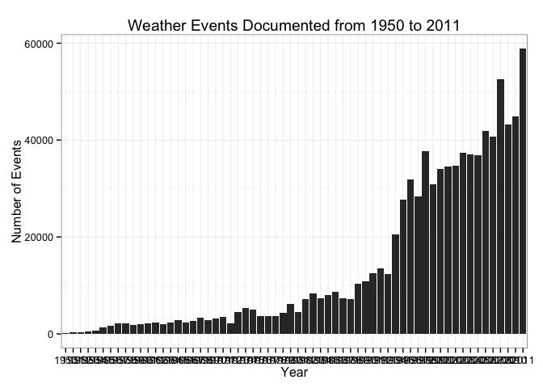
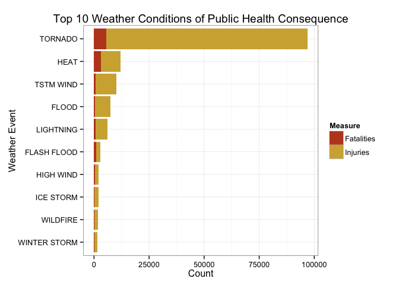
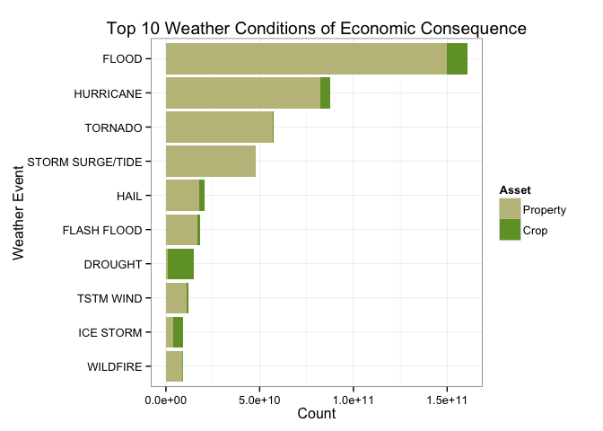

##Tornado and Floods: Weather Conditions of Consequence

<p style="font-size: 13pt; line-height:18pt"> 
**Author:** Florence Lee<br>
**Date:** 02-22-2015<br>
**Assignment:** RepData_PeerAssessment2</p>

====

###Synopsis

The purpose of this report is to utilize weather data to determine (1) which weather events posed the greatest threat to population health in the United States and (2) which weather events were the most costly. To meet our objectives, we used data provided by the US National Oceanic and Atmospheric Administration (NOAA). The dataset captures storms and other significant weather events between 1950 and the end of November 2011 for a total of 902,297 observations. At the end of our investigation, we discovered that tornados carried the greatest public health cost, while floods and hurricanes carried the greatest economic cost. The details of our findings are outlined below.

###Loading the Raw Data

The raw data and its accompanying documentation can be retrieved from the NOAA website. Set your working directory and run the following code to save the dataset locally and load the dataset into R. The dataset is large and may take a few minutes to download. 


```r
setwd("~/Desktop/DataScienceCoursera/RepData_PeerAssessment2") #change path to your working directory
download.file("https://d396qusza40orc.cloudfront.net/repdata%2Fdata%2FStormData.csv.bz2", 
              method = "curl", destfile = "stormdata.csv.bz2")
stormdata <- read.csv(bzfile("stormdata.csv.bz2"))
```

For this analysis, we used a few R packages that must be retrieved from the CRAN server. These packages can be loaded into RStudio using the ```library()``` function.


```r
library(plyr) 
library(dplyr)
library(tidyr)
library(datasets)
library(lubridate)
library(ggplot2)
```

###Cleaning and Processing the Data

After reading in the data, we explored the variables in the dataset:


```r
str(stormdata)
```

```
## 'data.frame':	902297 obs. of  37 variables:
##  $ STATE__   : num  1 1 1 1 1 1 1 1 1 1 ...
##  $ BGN_DATE  : Factor w/ 16335 levels "1/1/1966 0:00:00",..: 6523 6523 4242 11116 2224 2224 2260 383 3980 3980 ...
##  $ BGN_TIME  : Factor w/ 3608 levels "00:00:00 AM",..: 272 287 2705 1683 2584 3186 242 1683 3186 3186 ...
##  $ TIME_ZONE : Factor w/ 22 levels "ADT","AKS","AST",..: 7 7 7 7 7 7 7 7 7 7 ...
##  $ COUNTY    : num  97 3 57 89 43 77 9 123 125 57 ...
##  $ COUNTYNAME: Factor w/ 29601 levels "","5NM E OF MACKINAC BRIDGE TO PRESQUE ISLE LT MI",..: 13513 1873 4598 10592 4372 10094 1973 23873 24418 4598 ...
##  $ STATE     : Factor w/ 72 levels "AK","AL","AM",..: 2 2 2 2 2 2 2 2 2 2 ...
##  $ EVTYPE    : Factor w/ 985 levels "   HIGH SURF ADVISORY",..: 834 834 834 834 834 834 834 834 834 834 ...
##  $ BGN_RANGE : num  0 0 0 0 0 0 0 0 0 0 ...
##  $ BGN_AZI   : Factor w/ 35 levels "","  N"," NW",..: 1 1 1 1 1 1 1 1 1 1 ...
##  $ BGN_LOCATI: Factor w/ 54429 levels ""," Christiansburg",..: 1 1 1 1 1 1 1 1 1 1 ...
##  $ END_DATE  : Factor w/ 6663 levels "","1/1/1993 0:00:00",..: 1 1 1 1 1 1 1 1 1 1 ...
##  $ END_TIME  : Factor w/ 3647 levels ""," 0900CST",..: 1 1 1 1 1 1 1 1 1 1 ...
##  $ COUNTY_END: num  0 0 0 0 0 0 0 0 0 0 ...
##  $ COUNTYENDN: logi  NA NA NA NA NA NA ...
##  $ END_RANGE : num  0 0 0 0 0 0 0 0 0 0 ...
##  $ END_AZI   : Factor w/ 24 levels "","E","ENE","ESE",..: 1 1 1 1 1 1 1 1 1 1 ...
##  $ END_LOCATI: Factor w/ 34506 levels ""," CANTON"," TULIA",..: 1 1 1 1 1 1 1 1 1 1 ...
##  $ LENGTH    : num  14 2 0.1 0 0 1.5 1.5 0 3.3 2.3 ...
##  $ WIDTH     : num  100 150 123 100 150 177 33 33 100 100 ...
##  $ F         : int  3 2 2 2 2 2 2 1 3 3 ...
##  $ MAG       : num  0 0 0 0 0 0 0 0 0 0 ...
##  $ FATALITIES: num  0 0 0 0 0 0 0 0 1 0 ...
##  $ INJURIES  : num  15 0 2 2 2 6 1 0 14 0 ...
##  $ PROPDMG   : num  25 2.5 25 2.5 2.5 2.5 2.5 2.5 25 25 ...
##  $ PROPDMGEXP: Factor w/ 19 levels "","-","?","+",..: 17 17 17 17 17 17 17 17 17 17 ...
##  $ CROPDMG   : num  0 0 0 0 0 0 0 0 0 0 ...
##  $ CROPDMGEXP: Factor w/ 9 levels "","?","0","2",..: 1 1 1 1 1 1 1 1 1 1 ...
##  $ WFO       : Factor w/ 542 levels ""," CI","%SD",..: 1 1 1 1 1 1 1 1 1 1 ...
##  $ STATEOFFIC: Factor w/ 250 levels "","ALABAMA, Central",..: 1 1 1 1 1 1 1 1 1 1 ...
##  $ ZONENAMES : Factor w/ 25112 levels "","                                                                                                                               "| __truncated__,..: 1 1 1 1 1 1 1 1 1 1 ...
##  $ LATITUDE  : num  3040 3042 3340 3458 3412 ...
##  $ LONGITUDE : num  8812 8755 8742 8626 8642 ...
##  $ LATITUDE_E: num  3051 0 0 0 0 ...
##  $ LONGITUDE_: num  8806 0 0 0 0 ...
##  $ REMARKS   : Factor w/ 436781 levels "","\t","\t\t",..: 1 1 1 1 1 1 1 1 1 1 ...
##  $ REFNUM    : num  1 2 3 4 5 6 7 8 9 10 ...
```

Of the 37 variables, we are primarily concerned with ```BGN_DATE```, ```STATE```, ```EVTYPE```, ```FATALITIES```, ```INJURIES```, ```PROPDMG```, ```PROPDMGEXP```, ```CROPDMG```, and ```CROPDMGEXP``` for this investigation. For more thorough documentation on these variables, refer to the NOAA website. 

**Cleaning STATE Variable**

```STATE``` is a factor variable with 72 different levels.


```r
unique(stormdata$STATE)
```

```
##  [1] AL AZ AR CA CO CT DE DC FL GA HI ID IL IN IA KS KY LA ME MD MA MI MN
## [24] MS MO MT NE NV NH NJ NM NY NC ND OH OK OR PA RI SC SD TN TX UT VT VA
## [47] WA WV WI WY PR AK ST AS GU MH VI AM LC PH GM PZ AN LH LM LE LS SL LO
## [70] PM PK XX
## 72 Levels: AK AL AM AN AR AS AZ CA CO CT DC DE FL GA GM GU HI IA ID ... XX
```

For the purposes of this analysis, we limited our dataset to only events that occurred in the 50 states, which means US territories (e.g. Puerto Rico) will be unaccounted for. To do this, we used the ```state.abb``` dataset that comes with the ```dataset``` package. 


```r
stormdat2 <- stormdata[which(as.character(stormdata$STATE) %in% state.abb),]
length(unique(stormdat2$STATE))
```

```
## [1] 50
```

By removing events from regions outside of the 50 states, we lose about 2.12% of the raw data. Because the proportion is not alarmingly large, we do not expect this will affect the result of our investigation.

**Clean Date Variables**

There are two date variables in ```stormdat2```: the beginning date (```BGN_DATE```) and the end date (```END_DATE```). Even though we will not use these variables in our final analysis, it would be nice to have them in the proper format to explore our dataset further. 


```r
stormdat2$BGN_DATE <- as.POSIXct(strptime(stormdat2$BGN_DATE, "%m/%d/%Y %H:%M:%S"))
stormdat2$END_DATE <- as.POSIXct(strptime(stormdat2$END_DATE, "%m/%d/%Y %H:%M:%S"))
```

Converting the two variables into dates in this manner is imperfect, since not all the times share the same time zone (```TIME_ZONE```). We can, however, still use the year of each date to get an idea of when most our data was recorded. (We will explore this further after we clean ```EVTYPE```. 

**Clean EVTYPE**

According to the Storm Data Preparation document that accompanies this dataset, the NOAA only permits 48 different event types. And yet, this dataset contains over 985 event labels. 


```r
unique(stormdat2$EVTYPE)[order(unique(stormdat2$EVTYPE))]
```

```
##   [1]  COASTAL FLOOD                  FLASH FLOOD                  
##   [3]  LIGHTNING                      TSTM WIND                    
##   [5]  TSTM WIND (G45)                WATERSPOUT                   
##   [7]  WIND                          ?                             
##   [9] ABNORMAL WARMTH                ABNORMALLY DRY                
##  [11] ABNORMALLY WET                 ACCUMULATED SNOWFALL          
##  [13] AGRICULTURAL FREEZE            APACHE COUNTY                 
##  [15] ASTRONOMICAL HIGH TIDE         ASTRONOMICAL LOW TIDE         
##  [17] AVALANCE                       AVALANCHE                     
##  [19] BEACH EROSIN                   Beach Erosion                 
##  [21] BEACH EROSION                  BEACH EROSION/COASTAL FLOOD   
##  [23] BEACH FLOOD                    BELOW NORMAL PRECIPITATION    
##  [25] BITTER WIND CHILL              BITTER WIND CHILL TEMPERATURES
##  [27] Black Ice                      BLACK ICE                     
##  [29] BLIZZARD                       BLIZZARD AND EXTREME WIND CHIL
##  [31] BLIZZARD AND HEAVY SNOW        Blizzard Summary              
##  [33] BLIZZARD WEATHER               BLIZZARD/FREEZING RAIN        
##  [35] BLIZZARD/HEAVY SNOW            BLIZZARD/HIGH WIND            
##  [37] BLIZZARD/WINTER STORM          BLOW-OUT TIDE                 
##  [39] BLOW-OUT TIDES                 BLOWING DUST                  
##  [41] blowing snow                   Blowing Snow                  
##  [43] BLOWING SNOW                   BLOWING SNOW & EXTREME WIND CH
##  [45] BLOWING SNOW- EXTREME WIND CHI BLOWING SNOW/EXTREME WIND CHIL
##  [47] BREAKUP FLOODING               BRUSH FIRE                    
##  [49] BRUSH FIRES                    COASTAL  FLOODING/EROSION     
##  [51] COASTAL EROSION                Coastal Flood                 
##  [53] COASTAL FLOOD                  coastal flooding              
##  [55] Coastal Flooding               COASTAL FLOODING              
##  [57] COASTAL FLOODING/EROSION       Coastal Storm                 
##  [59] COASTAL STORM                  COASTAL SURGE                 
##  [61] COASTAL/TIDAL FLOOD            COASTALFLOOD                  
##  [63] COASTALSTORM                   Cold                          
##  [65] COLD                           COLD AIR FUNNEL               
##  [67] COLD AIR FUNNELS               COLD AIR TORNADO              
##  [69] Cold and Frost                 COLD AND FROST                
##  [71] COLD AND SNOW                  COLD AND WET CONDITIONS       
##  [73] Cold Temperature               COLD TEMPERATURES             
##  [75] COLD WAVE                      COLD WEATHER                  
##  [77] COLD WIND CHILL TEMPERATURES   COLD/WIND CHILL               
##  [79] COLD/WINDS                     COOL AND WET                  
##  [81] COOL SPELL                     CSTL FLOODING/EROSION         
##  [83] DAM BREAK                      DAM FAILURE                   
##  [85] Damaging Freeze                DAMAGING FREEZE               
##  [87] DEEP HAIL                      DENSE FOG                     
##  [89] DENSE SMOKE                    DOWNBURST                     
##  [91] DOWNBURST WINDS                DRIEST MONTH                  
##  [93] Drifting Snow                  DROUGHT                       
##  [95] DROUGHT/EXCESSIVE HEAT         DROWNING                      
##  [97] DRY                            DRY CONDITIONS                
##  [99] DRY HOT WEATHER                DRY MICROBURST                
## [101] DRY MICROBURST 50              DRY MICROBURST 53             
## [103] DRY MICROBURST 58              DRY MICROBURST 61             
## [105] DRY MICROBURST 84              DRY MICROBURST WINDS          
## [107] DRY MIRCOBURST WINDS           DRY PATTERN                   
## [109] DRY SPELL                      DRY WEATHER                   
## [111] DRYNESS                        DUST DEVEL                    
## [113] Dust Devil                     DUST DEVIL                    
## [115] DUST DEVIL WATERSPOUT          DUST STORM                    
## [117] DUST STORM/HIGH WINDS          DUSTSTORM                     
## [119] EARLY FREEZE                   Early Frost                   
## [121] EARLY FROST                    EARLY RAIN                    
## [123] EARLY SNOW                     Early snowfall                
## [125] EARLY SNOWFALL                 Erosion/Cstl Flood            
## [127] EXCESSIVE                      Excessive Cold                
## [129] EXCESSIVE HEAT                 EXCESSIVE HEAT/DROUGHT        
## [131] EXCESSIVE PRECIPITATION        EXCESSIVE RAIN                
## [133] EXCESSIVE RAINFALL             EXCESSIVE SNOW                
## [135] EXCESSIVE WETNESS              EXCESSIVELY DRY               
## [137] Extended Cold                  Extreme Cold                  
## [139] EXTREME COLD                   EXTREME COLD/WIND CHILL       
## [141] EXTREME HEAT                   EXTREME WIND CHILL            
## [143] EXTREME WIND CHILL/BLOWING SNO EXTREME WIND CHILLS           
## [145] EXTREME WINDCHILL              EXTREME WINDCHILL TEMPERATURES
## [147] EXTREME/RECORD COLD            EXTREMELY WET                 
## [149] FALLING SNOW/ICE               FIRST FROST                   
## [151] FIRST SNOW                     FLASH FLOOD                   
## [153] FLASH FLOOD - HEAVY RAIN       FLASH FLOOD FROM ICE JAMS     
## [155] FLASH FLOOD WINDS              FLASH FLOOD/                  
## [157] FLASH FLOOD/ FLOOD             FLASH FLOOD/ STREET           
## [159] FLASH FLOOD/FLOOD              FLASH FLOOD/HEAVY RAIN        
## [161] FLASH FLOODING                 FLASH FLOODING/FLOOD          
## [163] FLASH FLOODING/THUNDERSTORM WI FLASH FLOODS                  
## [165] FLASH FLOOODING                Flood                         
## [167] FLOOD                          FLOOD & HEAVY RAIN            
## [169] FLOOD FLASH                    FLOOD FLOOD/FLASH             
## [171] FLOOD WATCH/                   FLOOD/FLASH                   
## [173] Flood/Flash Flood              FLOOD/FLASH FLOOD             
## [175] FLOOD/FLASH FLOODING           FLOOD/FLASH/FLOOD             
## [177] FLOOD/FLASHFLOOD               FLOOD/RAIN/WIND               
## [179] FLOOD/RAIN/WINDS               FLOOD/RIVER FLOOD             
## [181] Flood/Strong Wind              FLOODING                      
## [183] FLOODING/HEAVY RAIN            FLOODS                        
## [185] FOG                            FOG AND COLD TEMPERATURES     
## [187] FOREST FIRES                   Freeze                        
## [189] FREEZE                         Freezing drizzle              
## [191] Freezing Drizzle               FREEZING DRIZZLE              
## [193] FREEZING DRIZZLE AND FREEZING  Freezing Fog                  
## [195] FREEZING FOG                   Freezing rain                 
## [197] Freezing Rain                  FREEZING RAIN                 
## [199] FREEZING RAIN AND SLEET        FREEZING RAIN AND SNOW        
## [201] FREEZING RAIN SLEET AND        FREEZING RAIN SLEET AND LIGHT 
## [203] FREEZING RAIN/SLEET            FREEZING RAIN/SNOW            
## [205] Freezing Spray                 Frost                         
## [207] FROST                          Frost/Freeze                  
## [209] FROST/FREEZE                   FROST\\FREEZE                 
## [211] FUNNEL                         Funnel Cloud                  
## [213] FUNNEL CLOUD                   FUNNEL CLOUD.                 
## [215] FUNNEL CLOUD/HAIL              FUNNEL CLOUDS                 
## [217] FUNNELS                        Glaze                         
## [219] GLAZE                          GLAZE ICE                     
## [221] GLAZE/ICE STORM                gradient wind                 
## [223] Gradient wind                  GRADIENT WIND                 
## [225] GRADIENT WINDS                 GRASS FIRES                   
## [227] GROUND BLIZZARD                GUSTNADO                      
## [229] GUSTNADO AND                   GUSTY LAKE WIND               
## [231] GUSTY THUNDERSTORM WIND        GUSTY THUNDERSTORM WINDS      
## [233] Gusty Wind                     GUSTY WIND                    
## [235] GUSTY WIND/HAIL                GUSTY WIND/HVY RAIN           
## [237] Gusty wind/rain                Gusty winds                   
## [239] Gusty Winds                    GUSTY WINDS                   
## [241] HAIL                           HAIL 0.75                     
## [243] HAIL 0.88                      HAIL 075                      
## [245] HAIL 088                       HAIL 1.00                     
## [247] HAIL 1.75                      HAIL 1.75)                    
## [249] HAIL 100                       HAIL 125                      
## [251] HAIL 150                       HAIL 175                      
## [253] HAIL 200                       HAIL 225                      
## [255] HAIL 275                       HAIL 450                      
## [257] HAIL 75                        HAIL 80                       
## [259] HAIL 88                        HAIL ALOFT                    
## [261] HAIL DAMAGE                    HAIL FLOODING                 
## [263] HAIL STORM                     Hail(0.75)                    
## [265] HAIL/ICY ROADS                 HAIL/WIND                     
## [267] HAIL/WINDS                     HAILSTORM                     
## [269] HAILSTORMS                     HARD FREEZE                   
## [271] HAZARDOUS SURF                 HEAT                          
## [273] HEAT DROUGHT                   Heat Wave                     
## [275] HEAT WAVE                      HEAT WAVE DROUGHT             
## [277] HEAT WAVES                     HEAT/DROUGHT                  
## [279] Heatburst                      HEAVY LAKE SNOW               
## [281] HEAVY MIX                      HEAVY PRECIPATATION           
## [283] Heavy Precipitation            HEAVY PRECIPITATION           
## [285] Heavy rain                     Heavy Rain                    
## [287] HEAVY RAIN                     HEAVY RAIN AND FLOOD          
## [289] Heavy Rain and Wind            HEAVY RAIN EFFECTS            
## [291] HEAVY RAIN; URBAN FLOOD WINDS; HEAVY RAIN/FLOODING           
## [293] Heavy Rain/High Surf           HEAVY RAIN/LIGHTNING          
## [295] HEAVY RAIN/MUDSLIDES/FLOOD     HEAVY RAIN/SEVERE WEATHER     
## [297] HEAVY RAIN/SNOW                HEAVY RAIN/WIND               
## [299] HEAVY RAINFALL                 HEAVY RAINS                   
## [301] HEAVY RAINS/FLOODING           HEAVY SEAS                    
## [303] HEAVY SNOW                     HEAVY SNOW   FREEZING RAIN    
## [305] HEAVY SNOW & ICE               HEAVY SNOW AND                
## [307] HEAVY SNOW AND HIGH WINDS      HEAVY SNOW AND ICE            
## [309] HEAVY SNOW AND ICE STORM       HEAVY SNOW AND STRONG WINDS   
## [311] HEAVY SNOW ANDBLOWING SNOW     Heavy snow shower             
## [313] HEAVY SNOW SQUALLS             HEAVY SNOW-SQUALLS            
## [315] HEAVY SNOW/BLIZZARD            HEAVY SNOW/BLIZZARD/AVALANCHE 
## [317] HEAVY SNOW/BLOWING SNOW        HEAVY SNOW/FREEZING RAIN      
## [319] HEAVY SNOW/HIGH                HEAVY SNOW/HIGH WIND          
## [321] HEAVY SNOW/HIGH WINDS          HEAVY SNOW/HIGH WINDS & FLOOD 
## [323] HEAVY SNOW/HIGH WINDS/FREEZING HEAVY SNOW/ICE                
## [325] HEAVY SNOW/ICE STORM           HEAVY SNOW/SLEET              
## [327] HEAVY SNOW/SQUALLS             HEAVY SNOW/WIND               
## [329] HEAVY SNOW/WINTER STORM        HEAVY SNOWPACK                
## [331] Heavy Surf                     HEAVY SURF                    
## [333] Heavy surf and wind            HEAVY SURF COASTAL FLOODING   
## [335] HEAVY SURF/HIGH SURF           HEAVY WET SNOW                
## [337] HIGH                           HIGH  WINDS                   
## [339] HIGH SEAS                      High Surf                     
## [341] HIGH SURF                      HIGH TEMPERATURE RECORD       
## [343] HIGH TIDES                     HIGH WATER                    
## [345] HIGH WAVES                     High Wind                     
## [347] HIGH WIND                      HIGH WIND (G40)               
## [349] HIGH WIND 48                   HIGH WIND 63                  
## [351] HIGH WIND 70                   HIGH WIND AND HEAVY SNOW      
## [353] HIGH WIND AND HIGH TIDES       HIGH WIND AND SEAS            
## [355] HIGH WIND DAMAGE               HIGH WIND/ BLIZZARD           
## [357] HIGH WIND/BLIZZARD             HIGH WIND/BLIZZARD/FREEZING RA
## [359] HIGH WIND/HEAVY SNOW           HIGH WIND/LOW WIND CHILL      
## [361] HIGH WIND/SEAS                 HIGH WIND/WIND CHILL          
## [363] HIGH WIND/WIND CHILL/BLIZZARD  HIGH WINDS                    
## [365] HIGH WINDS 55                  HIGH WINDS 57                 
## [367] HIGH WINDS 58                  HIGH WINDS 63                 
## [369] HIGH WINDS 66                  HIGH WINDS 67                 
## [371] HIGH WINDS 73                  HIGH WINDS 76                 
## [373] HIGH WINDS 80                  HIGH WINDS 82                 
## [375] HIGH WINDS AND WIND CHILL      HIGH WINDS DUST STORM         
## [377] HIGH WINDS HEAVY RAINS         HIGH WINDS/                   
## [379] HIGH WINDS/COASTAL FLOOD       HIGH WINDS/COLD               
## [381] HIGH WINDS/FLOODING            HIGH WINDS/HEAVY RAIN         
## [383] HIGH WINDS/SNOW                HIGHWAY FLOODING              
## [385] Hot and Dry                    HOT PATTERN                   
## [387] HOT SPELL                      HOT WEATHER                   
## [389] HOT/DRY PATTERN                HURRICANE                     
## [391] Hurricane Edouard              HURRICANE EMILY               
## [393] HURRICANE ERIN                 HURRICANE FELIX               
## [395] HURRICANE GORDON               HURRICANE OPAL                
## [397] HURRICANE OPAL/HIGH WINDS      HURRICANE-GENERATED SWELLS    
## [399] HURRICANE/TYPHOON              HVY RAIN                      
## [401] HYPERTHERMIA/EXPOSURE          HYPOTHERMIA                   
## [403] Hypothermia/Exposure           HYPOTHERMIA/EXPOSURE          
## [405] ICE                            ICE AND SNOW                  
## [407] ICE FLOES                      Ice Fog                       
## [409] ICE JAM                        Ice jam flood (minor          
## [411] ICE JAM FLOODING               ICE ON ROAD                   
## [413] ICE PELLETS                    ICE ROADS                     
## [415] ICE STORM                      ICE STORM AND SNOW            
## [417] ICE STORM/FLASH FLOOD          Ice/Snow                      
## [419] ICE/SNOW                       ICE/STRONG WINDS              
## [421] Icestorm/Blizzard              Icy Roads                     
## [423] ICY ROADS                      LACK OF SNOW                  
## [425] Lake Effect Snow               LAKE EFFECT SNOW              
## [427] LAKE FLOOD                     LAKE-EFFECT SNOW              
## [429] LAKESHORE FLOOD                LANDSLIDE                     
## [431] LANDSLIDES                     Landslump                     
## [433] LANDSLUMP                      LANDSPOUT                     
## [435] LARGE WALL CLOUD               LATE FREEZE                   
## [437] LATE SEASON HAIL               LATE SEASON SNOW              
## [439] Late Season Snowfall           LATE SNOW                     
## [441] Late-season Snowfall           LIGHT FREEZING RAIN           
## [443] Light snow                     Light Snow                    
## [445] LIGHT SNOW                     LIGHT SNOW AND SLEET          
## [447] Light Snow/Flurries            LIGHT SNOW/FREEZING PRECIP    
## [449] Light Snowfall                 LIGHTING                      
## [451] LIGHTNING                      LIGHTNING  WAUSEON            
## [453] LIGHTNING AND HEAVY RAIN       LIGHTNING AND THUNDERSTORM WIN
## [455] LIGHTNING AND WINDS            LIGHTNING DAMAGE              
## [457] LIGHTNING FIRE                 LIGHTNING INJURY              
## [459] LIGHTNING THUNDERSTORM WINDS   LIGHTNING THUNDERSTORM WINDSS 
## [461] LIGHTNING.                     LIGHTNING/HEAVY RAIN          
## [463] LIGNTNING                      LOCAL FLASH FLOOD             
## [465] LOCAL FLOOD                    LOCALLY HEAVY RAIN            
## [467] LOW TEMPERATURE                LOW TEMPERATURE RECORD        
## [469] LOW WIND CHILL                 MAJOR FLOOD                   
## [471] Marine Accident                MARINE MISHAP                 
## [473] Metro Storm, May 26            Microburst                    
## [475] MICROBURST                     MICROBURST WINDS              
## [477] Mild and Dry Pattern           MILD PATTERN                  
## [479] MILD/DRY PATTERN               MINOR FLOOD                   
## [481] Minor Flooding                 MINOR FLOODING                
## [483] MIXED PRECIP                   Mixed Precipitation           
## [485] MIXED PRECIPITATION            MODERATE SNOW                 
## [487] MODERATE SNOWFALL              MONTHLY PRECIPITATION         
## [489] Monthly Rainfall               MONTHLY RAINFALL              
## [491] Monthly Snowfall               MONTHLY SNOWFALL              
## [493] MONTHLY TEMPERATURE            Mountain Snows                
## [495] MUD SLIDE                      MUD SLIDES                    
## [497] MUD SLIDES URBAN FLOODING      MUD/ROCK SLIDE                
## [499] Mudslide                       MUDSLIDE                      
## [501] Mudslides                      MUDSLIDES                     
## [503] NEAR RECORD SNOW               No Severe Weather             
## [505] NON SEVERE HAIL                NON TSTM WIND                 
## [507] NON-SEVERE WIND DAMAGE         NON-TSTM WIND                 
## [509] NONE                           NORMAL PRECIPITATION          
## [511] NORTHERN LIGHTS                Other                         
## [513] OTHER                          PATCHY DENSE FOG              
## [515] PATCHY ICE                     Prolong Cold                  
## [517] PROLONG COLD                   PROLONG COLD/SNOW             
## [519] PROLONG WARMTH                 PROLONGED RAIN                
## [521] RAIN                           RAIN (HEAVY)                  
## [523] RAIN AND WIND                  Rain Damage                   
## [525] RAIN/SNOW                      RAIN/WIND                     
## [527] RAINSTORM                      RAPIDLY RISING WATER          
## [529] RECORD  COLD                   Record Cold                   
## [531] RECORD COLD                    RECORD COLD AND HIGH WIND     
## [533] RECORD COLD/FROST              RECORD COOL                   
## [535] Record dry month               RECORD DRYNESS                
## [537] Record Heat                    RECORD HEAT                   
## [539] RECORD HEAT WAVE               Record High                   
## [541] RECORD HIGH                    RECORD HIGH TEMPERATURE       
## [543] RECORD HIGH TEMPERATURES       RECORD LOW                    
## [545] RECORD LOW RAINFALL            Record May Snow               
## [547] RECORD PRECIPITATION           RECORD RAINFALL               
## [549] RECORD SNOW                    RECORD SNOW/COLD              
## [551] RECORD SNOWFALL                Record temperature            
## [553] RECORD TEMPERATURE             Record Temperatures           
## [555] RECORD TEMPERATURES            RECORD WARM                   
## [557] RECORD WARM TEMPS.             Record Warmth                 
## [559] RECORD WARMTH                  Record Winter Snow            
## [561] RECORD/EXCESSIVE HEAT          RECORD/EXCESSIVE RAINFALL     
## [563] RED FLAG CRITERIA              RED FLAG FIRE WX              
## [565] REMNANTS OF FLOYD              RIP CURRENT                   
## [567] RIP CURRENTS                   RIP CURRENTS HEAVY SURF       
## [569] RIP CURRENTS/HEAVY SURF        RIVER AND STREAM FLOOD        
## [571] RIVER FLOOD                    River Flooding                
## [573] RIVER FLOODING                 ROCK SLIDE                    
## [575] ROGUE WAVE                     ROTATING WALL CLOUD           
## [577] ROUGH SEAS                     ROUGH SURF                    
## [579] RURAL FLOOD                    Seasonal Snowfall             
## [581] SEICHE                         SEVERE COLD                   
## [583] SEVERE THUNDERSTORM            SEVERE THUNDERSTORM WINDS     
## [585] SEVERE THUNDERSTORMS           SEVERE TURBULENCE             
## [587] SLEET                          SLEET & FREEZING RAIN         
## [589] SLEET STORM                    SLEET/FREEZING RAIN           
## [591] SLEET/ICE STORM                SLEET/RAIN/SNOW               
## [593] SLEET/SNOW                     small hail                    
## [595] Small Hail                     SMALL HAIL                    
## [597] SMALL STREAM AND               SMALL STREAM AND URBAN FLOOD  
## [599] SMALL STREAM AND URBAN FLOODIN SMALL STREAM FLOOD            
## [601] SMALL STREAM FLOODING          SMALL STREAM URBAN FLOOD      
## [603] SMALL STREAM/URBAN FLOOD       Sml Stream Fld                
## [605] SMOKE                          Snow                          
## [607] SNOW                           Snow Accumulation             
## [609] SNOW ACCUMULATION              SNOW ADVISORY                 
## [611] SNOW AND COLD                  SNOW AND HEAVY SNOW           
## [613] Snow and Ice                   SNOW AND ICE                  
## [615] SNOW AND ICE STORM             Snow and sleet                
## [617] SNOW AND SLEET                 SNOW AND WIND                 
## [619] SNOW DROUGHT                   SNOW FREEZING RAIN            
## [621] SNOW SHOWERS                   SNOW SLEET                    
## [623] SNOW SQUALL                    Snow squalls                  
## [625] Snow Squalls                   SNOW SQUALLS                  
## [627] SNOW- HIGH WIND- WIND CHILL    SNOW/ BITTER COLD             
## [629] SNOW/ ICE                      SNOW/BLOWING SNOW             
## [631] SNOW/COLD                      SNOW/FREEZING RAIN            
## [633] SNOW/HEAVY SNOW                SNOW/HIGH WINDS               
## [635] SNOW/ICE                       SNOW/ICE STORM                
## [637] SNOW/RAIN                      SNOW/SLEET                    
## [639] SNOW/SLEET/FREEZING RAIN       SNOW/SLEET/RAIN               
## [641] SNOW\\COLD                     SNOWFALL RECORD               
## [643] SNOWMELT FLOODING              SNOWSTORM                     
## [645] SOUTHEAST                      STORM FORCE WINDS             
## [647] STORM SURGE                    STORM SURGE/TIDE              
## [649] STREAM FLOODING                STREET FLOOD                  
## [651] STREET FLOODING                Strong Wind                   
## [653] STRONG WIND                    STRONG WIND GUST              
## [655] Strong winds                   Strong Winds                  
## [657] STRONG WINDS                   Summary August 10             
## [659] Summary August 11              Summary August 17             
## [661] Summary August 2-3             Summary August 21             
## [663] Summary August 28              Summary August 4              
## [665] Summary August 7               Summary August 9              
## [667] Summary Jan 17                 Summary July 23-24            
## [669] Summary June 18-19             Summary June 5-6              
## [671] Summary June 6                 Summary of April 12           
## [673] Summary of April 13            Summary of April 21           
## [675] Summary of April 27            Summary of April 3rd          
## [677] Summary of August 1            Summary of July 11            
## [679] Summary of July 2              Summary of July 22            
## [681] Summary of July 26             Summary of July 29            
## [683] Summary of July 3              Summary of June 10            
## [685] Summary of June 11             Summary of June 12            
## [687] Summary of June 13             Summary of June 15            
## [689] Summary of June 16             Summary of June 18            
## [691] Summary of June 23             Summary of June 24            
## [693] Summary of June 3              Summary of June 30            
## [695] Summary of June 4              Summary of June 6             
## [697] Summary of March 14            Summary of March 23           
## [699] Summary of March 24            SUMMARY OF MARCH 24-25        
## [701] SUMMARY OF MARCH 27            SUMMARY OF MARCH 29           
## [703] Summary of May 10              Summary of May 13             
## [705] Summary of May 14              Summary of May 22             
## [707] Summary of May 22 am           Summary of May 22 pm          
## [709] Summary of May 26 am           Summary of May 26 pm          
## [711] Summary of May 31 am           Summary of May 31 pm          
## [713] Summary of May 9-10            Summary Sept. 25-26           
## [715] Summary September 20           Summary September 23          
## [717] Summary September 3            Summary September 4           
## [719] Summary: Nov. 16               Summary: Nov. 6-7             
## [721] Summary: Oct. 20-21            Summary: October 31           
## [723] Summary: Sept. 18              Temperature record            
## [725] THUDERSTORM WINDS              THUNDEERSTORM WINDS           
## [727] THUNDERESTORM WINDS            THUNDERSNOW                   
## [729] Thundersnow shower             THUNDERSTORM                  
## [731] THUNDERSTORM  WINDS            THUNDERSTORM DAMAGE           
## [733] THUNDERSTORM DAMAGE TO         THUNDERSTORM HAIL             
## [735] THUNDERSTORM W INDS            Thunderstorm Wind             
## [737] THUNDERSTORM WIND              THUNDERSTORM WIND (G40)       
## [739] THUNDERSTORM WIND 50           THUNDERSTORM WIND 52          
## [741] THUNDERSTORM WIND 56           THUNDERSTORM WIND 59          
## [743] THUNDERSTORM WIND 59 MPH       THUNDERSTORM WIND 59 MPH.     
## [745] THUNDERSTORM WIND 60 MPH       THUNDERSTORM WIND 65 MPH      
## [747] THUNDERSTORM WIND 65MPH        THUNDERSTORM WIND 69          
## [749] THUNDERSTORM WIND 98 MPH       THUNDERSTORM WIND G50         
## [751] THUNDERSTORM WIND G51          THUNDERSTORM WIND G52         
## [753] THUNDERSTORM WIND G55          THUNDERSTORM WIND G60         
## [755] THUNDERSTORM WIND G61          THUNDERSTORM WIND TREES       
## [757] THUNDERSTORM WIND.             THUNDERSTORM WIND/ TREE       
## [759] THUNDERSTORM WIND/ TREES       THUNDERSTORM WIND/AWNING      
## [761] THUNDERSTORM WIND/HAIL         THUNDERSTORM WIND/LIGHTNING   
## [763] THUNDERSTORM WINDS             THUNDERSTORM WINDS      LE CEN
## [765] THUNDERSTORM WINDS 13          THUNDERSTORM WINDS 2          
## [767] THUNDERSTORM WINDS 50          THUNDERSTORM WINDS 52         
## [769] THUNDERSTORM WINDS 53          THUNDERSTORM WINDS 60         
## [771] THUNDERSTORM WINDS 61          THUNDERSTORM WINDS 62         
## [773] THUNDERSTORM WINDS 63 MPH      THUNDERSTORM WINDS AND        
## [775] THUNDERSTORM WINDS FUNNEL CLOU THUNDERSTORM WINDS G          
## [777] THUNDERSTORM WINDS G60         THUNDERSTORM WINDS HAIL       
## [779] THUNDERSTORM WINDS HEAVY RAIN  THUNDERSTORM WINDS LIGHTNING  
## [781] THUNDERSTORM WINDS SMALL STREA THUNDERSTORM WINDS URBAN FLOOD
## [783] THUNDERSTORM WINDS.            THUNDERSTORM WINDS/ FLOOD     
## [785] THUNDERSTORM WINDS/ HAIL       THUNDERSTORM WINDS/FLASH FLOOD
## [787] THUNDERSTORM WINDS/FLOODING    THUNDERSTORM WINDS/FUNNEL CLOU
## [789] THUNDERSTORM WINDS/HAIL        THUNDERSTORM WINDS/HEAVY RAIN 
## [791] THUNDERSTORM WINDS53           THUNDERSTORM WINDSHAIL        
## [793] THUNDERSTORM WINDSS            THUNDERSTORM WINS             
## [795] THUNDERSTORMS                  THUNDERSTORMS WIND            
## [797] THUNDERSTORMS WINDS            THUNDERSTORMW                 
## [799] THUNDERSTORMW 50               THUNDERSTORMW WINDS           
## [801] THUNDERSTORMWINDS              THUNDERSTROM WIND             
## [803] THUNDERSTROM WINDS             THUNDERTORM WINDS             
## [805] THUNDERTSORM WIND              THUNDESTORM WINDS             
## [807] THUNERSTORM WINDS              TIDAL FLOOD                   
## [809] Tidal Flooding                 TIDAL FLOODING                
## [811] TORNADO                        TORNADO DEBRIS                
## [813] TORNADO F0                     TORNADO F1                    
## [815] TORNADO F2                     TORNADO F3                    
## [817] TORNADO/WATERSPOUT             TORNADOES                     
## [819] TORNADOES, TSTM WIND, HAIL     TORNADOS                      
## [821] TORNDAO                        TORRENTIAL RAIN               
## [823] Torrential Rainfall            TROPICAL DEPRESSION           
## [825] TROPICAL STORM                 TROPICAL STORM ALBERTO        
## [827] TROPICAL STORM DEAN            TROPICAL STORM GORDON         
## [829] TROPICAL STORM JERRY           TSTM                          
## [831] TSTM HEAVY RAIN                Tstm Wind                     
## [833] TSTM WIND                      TSTM WIND  (G45)              
## [835] TSTM WIND (41)                 TSTM WIND (G35)               
## [837] TSTM WIND (G40)                TSTM WIND (G45)               
## [839] TSTM WIND 40                   TSTM WIND 45                  
## [841] TSTM WIND 50                   TSTM WIND 51                  
## [843] TSTM WIND 52                   TSTM WIND 55                  
## [845] TSTM WIND 65)                  TSTM WIND AND LIGHTNING       
## [847] TSTM WIND DAMAGE               TSTM WIND G45                 
## [849] TSTM WIND G58                  TSTM WIND/HAIL                
## [851] TSTM WINDS                     TSTM WND                      
## [853] TSTMW                          TSUNAMI                       
## [855] TUNDERSTORM WIND               Unseasonable Cold             
## [857] UNSEASONABLY COLD              UNSEASONABLY COOL             
## [859] UNSEASONABLY COOL & WET        UNSEASONABLY DRY              
## [861] UNSEASONABLY HOT               UNSEASONABLY WARM             
## [863] UNSEASONABLY WARM & WET        UNSEASONABLY WARM AND DRY     
## [865] UNSEASONABLY WARM YEAR         UNSEASONABLY WARM/WET         
## [867] UNSEASONABLY WET               UNSEASONAL RAIN               
## [869] UNUSUAL WARMTH                 UNUSUAL/RECORD WARMTH         
## [871] UNUSUALLY COLD                 UNUSUALLY LATE SNOW           
## [873] UNUSUALLY WARM                 URBAN AND SMALL               
## [875] URBAN AND SMALL STREAM         URBAN AND SMALL STREAM FLOOD  
## [877] URBAN AND SMALL STREAM FLOODIN Urban flood                   
## [879] Urban Flood                    URBAN FLOOD                   
## [881] Urban Flooding                 URBAN FLOODING                
## [883] URBAN/SMALL                    URBAN/SMALL FLOODING          
## [885] URBAN/SMALL STREAM             URBAN/SMALL STREAM  FLOOD     
## [887] URBAN/SMALL STREAM FLOOD       URBAN/SMALL STREAM FLOODING   
## [889] URBAN/SMALL STRM FLDG          URBAN/SML STREAM FLD          
## [891] URBAN/SML STREAM FLDG          URBAN/STREET FLOODING         
## [893] VERY DRY                       VERY WARM                     
## [895] VOG                            VOLCANIC ASH                  
## [897] VOLCANIC ERUPTION              WAKE LOW WIND                 
## [899] WALL CLOUD                     WALL CLOUD/FUNNEL CLOUD       
## [901] WARM DRY CONDITIONS            WARM WEATHER                  
## [903] WATER SPOUT                    WATERSPOUT                    
## [905] WATERSPOUT TORNADO             WATERSPOUT-                   
## [907] WATERSPOUT-TORNADO             WATERSPOUT/                   
## [909] WATERSPOUT/ TORNADO            WATERSPOUT/TORNADO            
## [911] WATERSPOUTS                    WAYTERSPOUT                   
## [913] wet micoburst                  WET MICROBURST                
## [915] Wet Month                      WET SNOW                      
## [917] WET WEATHER                    Wet Year                      
## [919] Whirlwind                      WHIRLWIND                     
## [921] WILD FIRES                     WILD/FOREST FIRE              
## [923] WILD/FOREST FIRES              WILDFIRE                      
## [925] WILDFIRES                      Wind                          
## [927] WIND                           WIND ADVISORY                 
## [929] WIND AND WAVE                  WIND CHILL                    
## [931] WIND CHILL/HIGH WIND           Wind Damage                   
## [933] WIND DAMAGE                    WIND GUSTS                    
## [935] WIND STORM                     WIND/HAIL                     
## [937] WINDS                          WINTER MIX                    
## [939] WINTER STORM                   WINTER STORM HIGH WINDS       
## [941] WINTER STORM/HIGH WIND         WINTER STORM/HIGH WINDS       
## [943] WINTER STORMS                  Winter Weather                
## [945] WINTER WEATHER                 WINTER WEATHER MIX            
## [947] WINTER WEATHER/MIX             WINTERY MIX                   
## [949] Wintry mix                     Wintry Mix                    
## [951] WINTRY MIX                     WND                           
## 985 Levels:    HIGH SURF ADVISORY  COASTAL FLOOD ... WND
```

Sorting them by event shows that this discrepancy can be primarily attributed to one of three reasons:

1. Events are labeled inconsistently (e.g. Tstm Wind TSTM WIND, TSTM WIND 51 for thunderstorm wind).
2. Events outside of the NOAA's permitted list are included (e.g. UNSEASONABLY COLD).
3. Some observations are summaries rather than events (e.g. Summary August 7).

Since we are only interested in the events that have the greatest public health and economic impact on the country, these discrepancies in the raw data will have minimal effects on the final conclusion. Still, we decided to make the letter case of all the event names consistent, remove non-events, and collapse similar categories because this will ultimately make our findings a little more robust. When collapsing similar categories, we used the NOAA's permitted list as a guide for naming conventions.


```r
#Deal with inconsistent letter case
stormdat2$EVTYPE <- toupper(stormdat2$EVTYPE)
#Delete leading spaces
stormdat2$EVTYPE <- gsub(pattern = "^[ \t]+", replacement = "", x = stormdat2$EVTYPE)
#Delete "RECORD" event types
#Only comprise of 0.05% of the records
#Save into separate dataset in case you want to analyze
stormdat3 <- stormdat2[-grep(pattern = "RECORD", x = stormdat2$EVTYPE),]
#Delete non-events (e.g. SUMMARY, NONE, ?)
stormdat3 <- stormdat3[-grep(pattern = "MINOR|MONTHLY|SUMMARY|ABNORMAL|UNSEASON|UNUSUAL|WEATHER|^LATE|MONTH|YEAR|LIGHT ", stormdat3$EVTYPE),]
stormdat4 <- stormdat3[-which(stormdat3$EVTYPE== "?" | stormdat3$EVTYPE=="NONE"),]
#Clean AVALANCHE
stormdat4$EVTYPE[grep(pattern = "^AVAL", x = stormdat4$EVTYPE)] <- "AVALANCHE"
#Combine all BLIZZARD events
#Often combined with Heavy Snow, Freezing Rain, High Winds, which are characteristic of blizzards
stormdat4$EVTYPE[grep(pattern = "^BLIZZARD", x = stormdat4$EVTYPE)] <- "BLIZZARD"
#Combine all THUNDERSTORM events
stormdat4$EVTYPE[grep(pattern = "^TSTM|THUNDERSTORM|^THU|^TUN", x = stormdat4$EVTYPE)] <- "TSTM WIND"
#Combine all ICESTORM events
stormdat4$EVTYPE[grep(pattern = "ICE STORM|ICESTORM", x = stormdat4$EVTYPE)] <- "ICE STORM"
#Combine all WINTER STORM events
stormdat4$EVTYPE[grep(pattern = "WINTER STORM", x = stormdat4$EVTYPE)] <- "WINTER STORM"
#Combine all HURRICANE events
stormdat4$EVTYPE[grep(pattern = "HURRICANE", x = stormdat4$EVTYPE)] <- "HURRICANE"
#Combine all WATERSPOUT events
stormdat4$EVTYPE[grep(pattern = "WATER SPOUT|WATERSPOUT|RSPOUT", x = stormdat4$EVTYPE)] <- "WATERSPOUT"
#Combine HAIL events
stormdat4$EVTYPE[grep(pattern = "HAIL", x = stormdat4$EVTYPE)] <- "HAIL"
#Combine HIGH WINDS values into HIGH WINDS
stormdat4$EVTYPE[grep(pattern = "^HIGH WIND|^WHIRLWIND", x = stormdat4$EVTYPE)] <- "HIGH WIND"
#Combine all TROPICAL STORM events
stormdat4$EVTYPE[grep(pattern = "TROPICAL STORM", x = stormdat4$EVTYPE)] <- "TROPICAL STORM"
#Combine all TORNADO events
stormdat4$EVTYPE[grep(pattern = "TORNADO|^TORN", x = stormdat4$EVTYPE)] <- "TORNADO"
#Combine all WILDFIRE events
stormdat4$EVTYPE[grep(pattern = "WILD|FOREST", x = stormdat4$EVTYPE)] <- "WILDFIRE"
#Combine all LIGHTNING events
stormdat4$EVTYPE[grep(pattern = "^LIG.+ING$|LIGHTNING", x = stormdat4$EVTYPE)] <- "LIGHTNING"
#Combine all HEAVY SNOW and SNOWSTORM events
stormdat4$EVTYPE[grep(pattern = "HEAVY SNOW|SNOWSTORM", x = stormdat4$EVTYPE)] <- "HEAVY SNOW"
#Combine all HEAVY RAIN events
stormdat4$EVTYPE[grep(pattern = "HEAVY RAIN|RAINSTORM|RAIN DAMAGE", x = stormdat4$EVTYPE)] <- "HEAVY RAIN"
#Combine all ICY CONDITION events
stormdat4$EVTYPE[grep(pattern = "ICE\\s[^S].+$|.+ICE|^ICE$|^ICE\\S|ICY", x = stormdat4$EVTYPE)] <- "ICY CONDITIONS"
#Combine all HEAT events
stormdat4$EVTYPE[grep(pattern = "HEAT", x = stormdat4$EVTYPE)] <- "HEAT"
#Combine WINTER/WINTER STORM events
stormdat4$EVTYPE[grep(pattern = "^WIN\\w+\\sMIX$", x = stormdat4$EVTYPE)] <- "WINTER STORM"
#Combine all HIGH WIND events
stormdat4$EVTYPE[grep(pattern = "HIGH WIND|STORM FORCE WIND|WHRILWIND|WIND STORM|STRONG WIND|^WIND DAMAGE", x = stormdat4$EVTYPE)] <- "HIGH WIND"
#Combine all FROST events
stormdat4$EVTYPE[grep(pattern = "FROST", x = stormdat4$EVTYPE)] <- "FROST/FREEZE"
#Combine all FUNNEL CLOUD events
stormdat4$EVTYPE[grep(pattern = "FUNNEL", x = stormdat4$EVTYPE)] <- "FUNNEL CLOUD"
##Combine all FOG events
stormdat4$EVTYPE[grep(pattern = "^(\\w+)OG$|FOG", x = stormdat4$EVTYPE)] <- "DENSE FOG"
##Create distinct FLOOD events (FLASH, COASTAL, LAKESHORE, FLOOD)
stormdat4$EVTYPE[grep(pattern = "FLASH", x = stormdat4$EVTYPE)] <- "FLASH FLOOD"
stormdat4$EVTYPE[grep(pattern = "^C(\\w+)L(\\s)F|N/C(\\w+)L(\\s)F|TIDAL|COASTALFLOOD|BEACH FLOOD", x = stormdat4$EVTYPE)] <- "COASTAL FLOOD"
stormdat4$EVTYPE[grep(pattern = "LAKE(\\w*)\\sFLOOD", x = stormdat4$EVTYPE)] <- "LAKESHORE FLOOD"
stormdat4$EVTYPE[grep(pattern = "^[^FLC](.*)(\\s*)(.*)(\\s*)FL(\\w*)D(\\w*)$", x = stormdat4$EVTYPE)] <- "FLOOD"
stormdat4$EVTYPE[grep(pattern = "^FLOOD", x = stormdat4$EVTYPE)] <- "FLOOD"
#Combine all SLEET events
stormdat4$EVTYPE[grep(pattern = "SLEET", x = stormdat4$EVTYPE)] <- "SLEET"
#Clean RIP CURRENT events
stormdat4$EVTYPE[grep(pattern = "RIP", x = stormdat4$EVTYPE)] <- "RIP CURRENT"
#Clean HEAVY SURF events
stormdat4$EVTYPE[grep(pattern = "SURF", x = stormdat4$EVTYPE)] <- "HEAVY SURF"
#Combine COLD/WINDCHILL events
stormdat4$EVTYPE[grep(pattern = "COLD|CHILL", x = stormdat4$EVTYPE)] <- "COLD/WIND CHILL"
#Combine STORM SURGE/TIDE events
stormdat4$EVTYPE[grep(pattern = "STORM SURGE", x = stormdat4$EVTYPE)] <- "STORM SURGE/TIDE"
```

Even though our final list of EVTYPES is not completely clean, we are now down to 222 event types. The majority of the categories in the NOAA permitted list are cleaned.


```r
unique(stormdat4$EVTYPE)[order(unique(stormdat4$EVTYPE))]
```

```
##   [1] "ACCUMULATED SNOWFALL"           "AGRICULTURAL FREEZE"           
##   [3] "APACHE COUNTY"                  "ASTRONOMICAL HIGH TIDE"        
##   [5] "ASTRONOMICAL LOW TIDE"          "AVALANCHE"                     
##   [7] "BEACH EROSIN"                   "BEACH EROSION"                 
##   [9] "BELOW NORMAL PRECIPITATION"     "BLIZZARD"                      
##  [11] "BLOW-OUT TIDE"                  "BLOW-OUT TIDES"                
##  [13] "BLOWING DUST"                   "BLOWING SNOW"                  
##  [15] "BLOWING SNOW & EXTREME WIND CH" "BLOWING SNOW- EXTREME WIND CHI"
##  [17] "BLOWING SNOW/EXTREME WIND CHIL" "BRUSH FIRE"                    
##  [19] "BRUSH FIRES"                    "COASTAL  FLOODING/EROSION"     
##  [21] "COASTAL EROSION"                "COASTAL FLOOD"                 
##  [23] "COASTAL STORM"                  "COASTAL SURGE"                 
##  [25] "COASTALSTORM"                   "COLD/WIND CHILL"               
##  [27] "COOL AND WET"                   "COOL SPELL"                    
##  [29] "DAM BREAK"                      "DAM FAILURE"                   
##  [31] "DAMAGING FREEZE"                "DENSE FOG"                     
##  [33] "DENSE SMOKE"                    "DOWNBURST"                     
##  [35] "DOWNBURST WINDS"                "DRIFTING SNOW"                 
##  [37] "DROUGHT"                        "DROWNING"                      
##  [39] "DRY"                            "DRY CONDITIONS"                
##  [41] "DRY MICROBURST"                 "DRY MICROBURST 50"             
##  [43] "DRY MICROBURST 53"              "DRY MICROBURST 58"             
##  [45] "DRY MICROBURST 61"              "DRY MICROBURST 84"             
##  [47] "DRY MICROBURST WINDS"           "DRY MIRCOBURST WINDS"          
##  [49] "DRY PATTERN"                    "DRY SPELL"                     
##  [51] "DRYNESS"                        "DUST DEVEL"                    
##  [53] "DUST DEVIL"                     "DUST STORM"                    
##  [55] "DUSTSTORM"                      "EARLY FREEZE"                  
##  [57] "EARLY RAIN"                     "EARLY SNOW"                    
##  [59] "EARLY SNOWFALL"                 "EXCESSIVE"                     
##  [61] "EXCESSIVE PRECIPITATION"        "EXCESSIVE RAIN"                
##  [63] "EXCESSIVE RAINFALL"             "EXCESSIVE SNOW"                
##  [65] "EXCESSIVE WETNESS"              "EXCESSIVELY DRY"               
##  [67] "EXTREMELY WET"                  "FIRST SNOW"                    
##  [69] "FLASH FLOOD"                    "FLOOD"                         
##  [71] "FREEZE"                         "FREEZING DRIZZLE"              
##  [73] "FREEZING DRIZZLE AND FREEZING"  "FREEZING RAIN"                 
##  [75] "FREEZING RAIN AND SNOW"         "FREEZING RAIN/SNOW"            
##  [77] "FREEZING SPRAY"                 "FROST/FREEZE"                  
##  [79] "FUNNEL CLOUD"                   "GLAZE"                         
##  [81] "GRADIENT WIND"                  "GRADIENT WINDS"                
##  [83] "GRASS FIRES"                    "GROUND BLIZZARD"               
##  [85] "GUSTNADO"                       "GUSTNADO AND"                  
##  [87] "GUSTY LAKE WIND"                "GUSTY WIND"                    
##  [89] "GUSTY WIND/HVY RAIN"            "GUSTY WIND/RAIN"               
##  [91] "GUSTY WINDS"                    "HAIL"                          
##  [93] "HARD FREEZE"                    "HEAT"                          
##  [95] "HEAVY LAKE SNOW"                "HEAVY MIX"                     
##  [97] "HEAVY PRECIPATATION"            "HEAVY PRECIPITATION"           
##  [99] "HEAVY RAIN"                     "HEAVY SEAS"                    
## [101] "HEAVY SNOW"                     "HEAVY SURF"                    
## [103] "HEAVY WET SNOW"                 "HIGH"                          
## [105] "HIGH  WINDS"                    "HIGH SEAS"                     
## [107] "HIGH TIDES"                     "HIGH WATER"                    
## [109] "HIGH WAVES"                     "HIGH WIND"                     
## [111] "HOT AND DRY"                    "HOT PATTERN"                   
## [113] "HOT SPELL"                      "HOT/DRY PATTERN"               
## [115] "HURRICANE"                      "HVY RAIN"                      
## [117] "HYPERTHERMIA/EXPOSURE"          "HYPOTHERMIA"                   
## [119] "HYPOTHERMIA/EXPOSURE"           "ICE STORM"                     
## [121] "ICY CONDITIONS"                 "LACK OF SNOW"                  
## [123] "LAKE EFFECT SNOW"               "LAKE-EFFECT SNOW"              
## [125] "LAKESHORE FLOOD"                "LANDSLIDE"                     
## [127] "LANDSLIDES"                     "LANDSLUMP"                     
## [129] "LANDSPOUT"                      "LARGE WALL CLOUD"              
## [131] "LIGHTNING"                      "LOCAL FLOOD"                   
## [133] "LOW TEMPERATURE"                "MARINE ACCIDENT"               
## [135] "MARINE MISHAP"                  "METRO STORM, MAY 26"           
## [137] "MICROBURST"                     "MICROBURST WINDS"              
## [139] "MILD AND DRY PATTERN"           "MILD PATTERN"                  
## [141] "MILD/DRY PATTERN"               "MIXED PRECIP"                  
## [143] "MIXED PRECIPITATION"            "MODERATE SNOW"                 
## [145] "MODERATE SNOWFALL"              "MOUNTAIN SNOWS"                
## [147] "MUD SLIDE"                      "MUD SLIDES"                    
## [149] "MUD/ROCK SLIDE"                 "MUDSLIDE"                      
## [151] "MUDSLIDES"                      "NON TSTM WIND"                 
## [153] "NON-SEVERE WIND DAMAGE"         "NON-TSTM WIND"                 
## [155] "NORMAL PRECIPITATION"           "NORTHERN LIGHTS"               
## [157] "OTHER"                          "PROLONG WARMTH"                
## [159] "PROLONGED RAIN"                 "RAIN"                          
## [161] "RAIN (HEAVY)"                   "RAIN AND WIND"                 
## [163] "RAIN/SNOW"                      "RAIN/WIND"                     
## [165] "RAPIDLY RISING WATER"           "RED FLAG CRITERIA"             
## [167] "RED FLAG FIRE WX"               "RIP CURRENT"                   
## [169] "ROCK SLIDE"                     "ROGUE WAVE"                    
## [171] "ROTATING WALL CLOUD"            "ROUGH SEAS"                    
## [173] "SEASONAL SNOWFALL"              "SEICHE"                        
## [175] "SEVERE TURBULENCE"              "SLEET"                         
## [177] "SMALL STREAM AND"               "SMOKE"                         
## [179] "SNOW"                           "SNOW ACCUMULATION"             
## [181] "SNOW ADVISORY"                  "SNOW AND WIND"                 
## [183] "SNOW DROUGHT"                   "SNOW FREEZING RAIN"            
## [185] "SNOW SHOWERS"                   "SNOW SQUALL"                   
## [187] "SNOW SQUALLS"                   "SNOW/BLOWING SNOW"             
## [189] "SNOW/FREEZING RAIN"             "SNOW/RAIN"                     
## [191] "SOUTHEAST"                      "STORM SURGE/TIDE"              
## [193] "TORNADO"                        "TORRENTIAL RAIN"               
## [195] "TORRENTIAL RAINFALL"            "TROPICAL DEPRESSION"           
## [197] "TROPICAL STORM"                 "TSTM WIND"                     
## [199] "TSUNAMI"                        "URBAN AND SMALL"               
## [201] "URBAN AND SMALL STREAM"         "URBAN/SMALL"                   
## [203] "URBAN/SMALL STREAM"             "VERY DRY"                      
## [205] "VERY WARM"                      "VOLCANIC ASH"                  
## [207] "VOLCANIC ERUPTION"              "WAKE LOW WIND"                 
## [209] "WALL CLOUD"                     "WARM DRY CONDITIONS"           
## [211] "WATERSPOUT"                     "WET MICOBURST"                 
## [213] "WET MICROBURST"                 "WET SNOW"                      
## [215] "WILDFIRE"                       "WIND"                          
## [217] "WIND ADVISORY"                  "WIND AND WAVE"                 
## [219] "WIND GUSTS"                     "WINDS"                         
## [221] "WINTER STORM"                   "WND"
```

**Number of Events Recorded Per Year**

In order to get a sense of how our data was collected from 1950 to 2011, we created a histogram of the number of events per year.


```r
eventsByDate <- as.data.frame(table(stormdat4$EVTYPE, year(stormdat4$BGN_DAT)))
names(eventsByDate) <- c("Event", "Year", "NumEvents")
eventsByYear <- summarise(group_by(eventsByDate, Year), TotalEvents = sum(NumEvents))
evBase <- ggplot(eventsByYear, aes(x = Year, y = TotalEvents)) + 
     geom_bar(stat = "identity")
evLabel <- labs(title = "Weather Events Documented from 1950 to 2011", 
                    x = "Year", y = "Number of Events")
evBase + theme_bw() + evLabel
```

 

Most of the documented weather events in this data set were collected after 1994. This suggests that there were either an increase in severe weather events after 1994 OR that data collection efforts were much more regimented closer to the turn of the century. Either way, this is something to keep in mind as we examine our findings. 

###Results

**Weather Events of Greatest Public Health Consequence**

In order to determine the weather events of the greatest public health consequence, we were interested in looking at ```FATALITIES``` and ```INJURIES``` due to certain ```EVTYPE```. The weather events that are most deterimental to population health will be those that result in the greatest number (or sum) of fatalities and injuries. 

First, we want to create two tables: one for total fatalities by event type and one for total injuries by event type.


```r
eventFatal <- summarise(group_by(stormdat4, EVTYPE), TotalFatal=sum(FATALITIES))
eventFatal <- arrange(eventFatal, desc(TotalFatal))
head(eventFatal, n = 10)
```

```
## Source: local data frame [10 x 2]
## 
##             EVTYPE TotalFatal
## 1          TORNADO       5633
## 2             HEAT       3097
## 3      FLASH FLOOD        994
## 4        LIGHTNING        807
## 5        TSTM WIND        709
## 6      RIP CURRENT        523
## 7            FLOOD        504
## 8  COLD/WIND CHILL        457
## 9        HIGH WIND        405
## 10       AVALANCHE        225
```

```r
eventInj <- summarise(group_by(stormdat4, EVTYPE), TotalInj=sum(INJURIES))
eventInj <- arrange(eventInj, desc(TotalInj))
head(eventInj, n = 10)
```

```
## Source: local data frame [10 x 2]
## 
##          EVTYPE TotalInj
## 1       TORNADO    91364
## 2     TSTM WIND     9463
## 3          HEAT     8858
## 4         FLOOD     6870
## 5     LIGHTNING     5213
## 6     ICE STORM     1992
## 7   FLASH FLOOD     1790
## 8     HIGH WIND     1790
## 9      WILDFIRE     1605
## 10 WINTER STORM     1430
```

In regards to both fatalities and injuries, tornados seem to hurt the population the most. To create a visual of this, we have to first join the two tables on ```EVTYPE``` and then select the top 10 to display. The following table, ```eventSumTop``` shows the top 10 events, ordered by the total number of fatalities and injuries.


```r
eventSum <- join(x = eventFatal, y = eventInj)
```

```
## Joining by: EVTYPE
```

```r
eventSum2 <- mutate(eventSum, Total = TotalInj + TotalFatal)
eventSum2 <- arrange(eventSum2, desc(Total))
eventSumTop <- select(eventSum2[1:10,], -Total)
names(eventSumTop) <- c("Event", "Fatalities", "Injuries")
eventSumTop
```

```
##           Event Fatalities Injuries
## 1       TORNADO       5633    91364
## 2          HEAT       3097     8858
## 3     TSTM WIND        709     9463
## 4         FLOOD        504     6870
## 5     LIGHTNING        807     5213
## 6   FLASH FLOOD        994     1790
## 7     HIGH WIND        405     1790
## 8     ICE STORM         89     1992
## 9      WILDFIRE         90     1605
## 10 WINTER STORM        217     1430
```


```r
eventSumMelt <- gather(data = eventSumTop, key = Measure, value = Count, c(Fatalities, Injuries))
hlthbase <- ggplot(eventSumMelt, aes(x = factor(Event, levels = unique(rev(Event))), y = Count, 
                                 fill = Measure)) + geom_bar(stat = "identity")
hlthlabels <- labs(title = "Top 10 Weather Conditions of Public Health Consequence",
               x = "Weather Event", y = "Count")
mycol <- c("#BE4722", "#D1AF40")
hlthcolors <- scale_fill_manual(values=mycol)
hlthbase + coord_flip() + theme_bw() + hlthlabels + hlthcolors
```

 

Even if we had separated this stacked bar graph into two separate graphs--one for the top 10 events based on fatalities and another for the top 10 events based on injuries--tornados would still come out as the most injurious of all weather events. 

**Weather Events of Greatest Economic Consequence**

In order to determine the total economic cost of each weather event based on property damage and crop damage, we have to look at the following columns: ```PROPDMG```, ```CROPDMG```, ```PROPDMGEXP```, and ```CROPDMGEXP```. The ```-EXP``` columns give us the multiplier for each value in listed in ```PROPDMG``` and ```CROPDMG```. Below is a list of the levels in ```-EXP``` and their accompanying multiplier.

-EXP     | Multiplier
------------- | -------------
H | 100
K | 1000
M | 1,000,000
B | 1,000,000,000
- | 0
+ | 1
? | 0
0-9 | 10

Because we are interested in the value of the damages, we will need to create two additional columns: one for the *value* of property damage and one for the *value* of crop damage.


```r
#For PROPDMG
stormdat4$PROPDMGEXP <- toupper(stormdat4$PROPDMGEXP)
stormdat4$PROPEXP <- stormdat4$PROPDMGEXP
pExp <- unique(stormdat4$PROPDMGEXP)
pExpVal <- c(1e3, 1e6, 0, 1e9, 1, 10, 10, 10, 0, 10, 10, 10, 1e2, 10, 0, 10, 10)
for (i in seq_along(pExp)) {
     stormdat4$PROPEXP[which(stormdat4$PROPDMGEXP==pExp[i])] <- pExpVal[i] 
}
stormdat4$PROPEXP <- as.numeric(stormdat4$PROPEXP)
stormdat4 <- mutate(stormdat4, PROPDMGVAL = PROPEXP*PROPDMG)

#For CROPDMG
stormdat4$CROPDMGEXP <- toupper(as.character(stormdat4$CROPDMGEXP))
stormdat4$CROPEXP <- stormdat4$CROPDMGEXP
cExp <- unique(stormdat4$CROPDMGEXP)
cExpVal <- c(0, 1e6, 1e3, 1e9, 0, 10, 10)
for (i in seq_along(cExp)) {
     stormdat4$CROPEXP[which(stormdat4$CROPDMGEXP==cExp[i])] <- cExpVal[i] 
}  
stormdat4$CROPEXP <- as.numeric(stormdat4$CROPEXP)
stormdat4 <- mutate(stormdat4, CROPDMGVAL = CROPEXP*CROPDMG)
```

Now that we have the value of property damage (```PROPDMGVAL```) and the value of crop damage (```CROPDMGVAL```), we can create one table for total property damage by event and another for total crop damage by event.


```r
eventProp <- summarise(group_by(stormdat4, EVTYPE), TotalProp=sum(PROPDMGVAL))
eventProp <- arrange(eventProp, desc(TotalProp))
head(eventProp, n = 10)
```

```
## Source: local data frame [10 x 2]
## 
##              EVTYPE    TotalProp
## 1             FLOOD 150073697330
## 2         HURRICANE  82529119010
## 3           TORNADO  56941462647
## 4  STORM SURGE/TIDE  47963499000
## 5              HAIL  17574555877
## 6       FLASH FLOOD  16632753053
## 7         TSTM WIND  10950342912
## 8          WILDFIRE   8489491500
## 9    TROPICAL STORM   7485621550
## 10     WINTER STORM   6749504760
```

```r
eventCrop <- summarise(group_by(stormdat4, EVTYPE), TotalCrop=sum(CROPDMGVAL))
eventCrop <- arrange(eventCrop, desc(TotalCrop))
head(eventCrop, n = 10)
```

```
## Source: local data frame [10 x 2]
## 
##             EVTYPE   TotalCrop
## 1          DROUGHT 13972361000
## 2            FLOOD 10802941050
## 3        ICE STORM  5022113500
## 4        HURRICANE  4958940800
## 5             HAIL  3049387800
## 6      FLASH FLOOD  1517785150
## 7  COLD/WIND CHILL  1396623000
## 8        TSTM WIND  1271657700
## 9     FROST/FREEZE  1202186000
## 10            HEAT   904469280
```

Here, we see that FLOOD is the most costly in terms of property damage, but DROUGHT is the most costly in terms of crop damage. If we wanted to lump property damage and crop damage into one--for an aggregate measure of economic cost--we can do that by joining the two tables.


```r
eventDmgSum <- join(x = eventProp, y = eventCrop)
```

```
## Joining by: EVTYPE
```

```r
eventDmgSum2 <- mutate(eventDmgSum, Total = TotalProp + TotalCrop)
eventDmgSum2 <- arrange(eventDmgSum2, desc(Total))
eventDmgTop <- select(eventDmgSum2[1:10,], -Total)
names(eventDmgTop) <- c("Event", "Property", "Crop")
eventDmgTop
```

```
##               Event     Property        Crop
## 1             FLOOD 150073697330 10802941050
## 2         HURRICANE  82529119010  4958940800
## 3           TORNADO  56941462647   414961960
## 4  STORM SURGE/TIDE  47963499000        5000
## 5              HAIL  17574555877  3049387800
## 6       FLASH FLOOD  16632753053  1517785150
## 7           DROUGHT   1041106000 13972361000
## 8         TSTM WIND  10950342912  1271657700
## 9         ICE STORM   3946008310  5022113500
## 10         WILDFIRE   8489491500   402116630
```

When we order the events based on TOTAL economic cost, we see that FLOODS are the most costly of all the severe weather events based on NOAA data. We can visualize this information in a bar graph:


```r
eventDmgMelt <- gather(data = eventDmgTop, key = Asset, value = Count, c(Property, Crop))
dmgbase <- ggplot(eventDmgMelt, aes(x = factor(Event, levels = unique(rev(Event))), y = Count, 
                                 fill = Asset)) + geom_bar(stat = "identity")
dmglabels <- labs(title = "Top 10 Weather Conditions of Economic Consequence",
               x = "Weather Event", y = "Count")
mycol <- c("#C0BF8B", "#709E30")
dmgcolors <- scale_fill_manual(values=mycol)
dmgbase + coord_flip() + theme_bw() + dmglabels + dmgcolors
```

 

Based on the graph, we see that even though FLOODS, HURRICANES, TORNADOS, and STORM SURGES resulted in the most economic damage from 1950 to 2011. The bulk of their costs were attributed to damaged property. Interestingly, DROUGHTS were only the 7th most costly  event despite carrying the greatest cost due to damaged crops.
